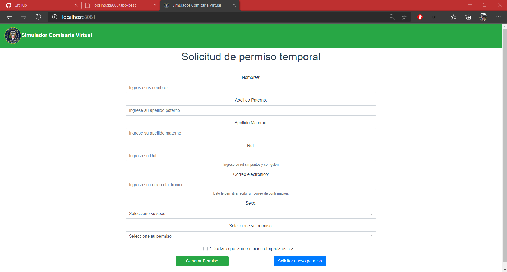
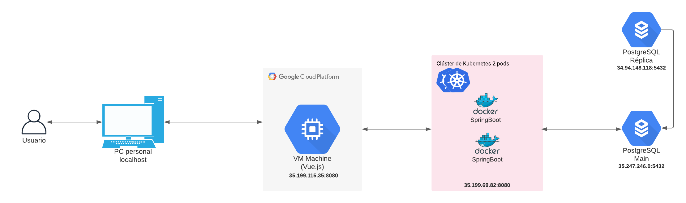
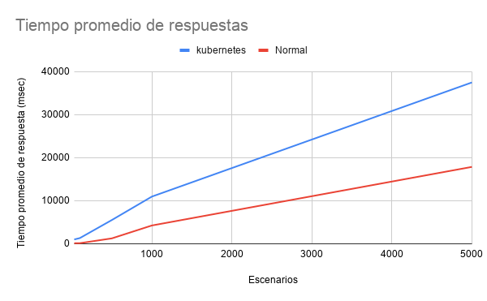
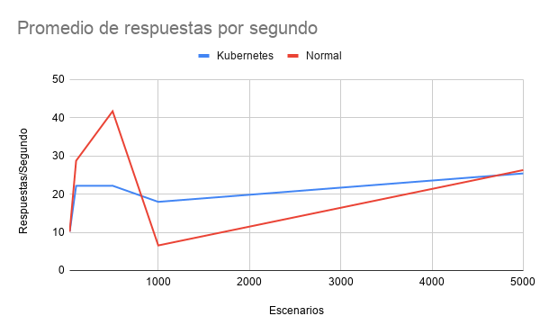

# Pep 1: Sistemas Distribuidos

Integrantes:
- Maximiliano Arévalo Sáez
- Juan Fernández Muñoz

## Contexto

En la actualidad muchos sistemas de información, aplicaciones, sistemas web de uso general,
entre otros; se han desarrollado sobre contextos de cubicación o estimación de la demanda
computacional que tendrían dichos sistemas en contextos normales (ej: Web registro civil,
comisaría virtual carabineros, sistemas de emergencias, entre otros).

Ahora bien, si llevamos estos sistemas legados o heredados de contextos anteriores al contexto 
actual, en donde la demanda de consultas se incrementado (9 veces en consultas sobre recursos educativos,
60 % en compras en línea de insumos básicos, 30 % en compras de comercio que no son de primera necesidad), 
estos sistemas carecen de respuesta, quedando sin otorgar el servicio que deberían a los clientes, 
generando problemáticas mucho más complejas desde una perspectiva social y sistémica.

## Desarrollo y análisis de sistema legado

Para el desarrollo del primer entregable se utilizan las siguientes tecnologías:

- Frontend: Vue.js
- Backend: Springboot
- Base de Datos: PostgreSQL

Los cuales se utilizan para el desarrollo e implementación del entregable, considerando la arquitectura computacional indicada en el enunciado y mostrada a continuación:

## Funcionamiento del sistema

Para ejecutar el proyecto, es necesario utilizar dos consolas que permitan iniciar el funcionamiento del frontend y del backend, y contar con una base de datos para el funcionamiento de lo mencionado anteriormente.

Para ejecutar el backend, es necesario situarse en la carpeta "/backend" y escribir el comando:
- mvn spring-boot:run

Lo cual despliega el backend en la ruta "/localhost:8080"

Para ejecutar el frontend, es necesario situarse en la carpeta "/frontend" y escribir los comandos:
- npm install
- npm run serve

Lo cual despliega el frontend en la ruta "/localhost:8081"

Mientras que para el caso de la base de datos, basta con crearla utilizando la plataforma PgAdmin4.

## Implementación del sistema

Al ingresar a la ruta correspondiente al frontend, se presenta un formulario que contiene los campos
necesarios para generar el permiso temporal, tales como: nombres, apellidos, rut, correo electrónico,
sexo y motivo del permiso. Al final se solicita marcar una casilla que indica que los datos ingresados
son los correspondientes. Además existen dos botones, uno para generar el permiso y otro para solicitar uno 
nuevo en caso de que ya haya obtenido uno.

Una vez que el usuario ingrese todos los campos requeridos para obtener el permiso temporal, es necesario que
marque la casilla al final y luego presione el botón de "Generar Permiso".

Luego de presionar el botón de "Generar Permiso", al desplazar la página hacia abajo se presenta una alerta que
indica la generación exitosa del permiso temporal. En la cual se entregan los datos del identificador del permiso generado,
el nombre y rut del solicitante, el motivo del permiso y las fechas y hora de inicio y término de este.

En caso de que se haya generado un permiso temporal y se requiera obtener otro nuevamente, solo basta con presionar
el botón "Solicitar nuevo permiso", el cual vacía el formulario y lo dispone para ingresar los datos para un nuevo
permiso. 

Finalmente, el usuario es notificado con una copia del permiso temporal generado mediante un mensaje al correo electrónico
indicado en el formulario.

## Características de los sistemas distribuidos

|Característica|Descripción|¿El sistema lo posee?|
|--------------|-----------|---------------------|
|Disponibilidad|Trata sobre la disponibilidad de los recursos, donde se tiene que facilitar a los usuarios el acceder a recursos remotos que permitan obtener un resultado.|El sistema no lo posee, porque actualmente se encuentra implementado de manera local y por ende no accede a recursos remotos. Además, si falla el dispositivo, una de las desventajas es que el sistema dejaría de responder y otra es que si se pierden los datos no sería posible ponerlos a disposición de una manera rápida.|
|Transparencia de la distribución|Se basa en hacer creer al usuario que los procesos y recursos que utiliza el sistema se encuentran dentro de la misma máquina, por lo que se le oculta que los componentes del sistema distribuido se ejecutan separados en diferentes máquinas.|El sistema no puede ser considerado transparente, ya que actualmente funciona de manera local y no se encuentra distribuido.|
|Apertura|Un sistema distribuido abierto es el que permite ofrecer servicios bajo reglas estándar de sintaxis y semántica que faciliten la comunicación entre componentes. Junto con realizar cambios e implementar nuevos servicios de manera sencilla sin generar complicaciones en el sistema.|El sistema lo posee, ya que cuenta con la comunicación estándar de los componentes de Frontend y Backend utilizando API REST, cumpliendo con lo requerido para la característica.|
|Escalabilidad|Un sistema es escalable si es capaz de aumentar o disminuir la cantidad de recursos según lo que se le demande en determinadas condiciones, es decir, aumentar o disminuir su capacidad de respuesta de manera dinámica. La escalibilidad puede ser horizontal, lo que implica que un sistema aumenta la cantidad de recursos, o vertical, que implica aumenta la capacidad de recursos.|El sistema no es escalable, ya que no tiene la posibilidad de asignar los recursos de manera dinámica en base a la demanda. Además, no es posible responder varias consultas a la vez debido a que se pueden producir cuellos de botella y tampoco se implementa caché, por lo que los tiempos de respuesta no se ven disminuidos.|

## Pruebas y resultados

Al momentos de realizar las pruebas, se omite el uso del envío de correo electrónico, esto debido a que gmail, outlook, y otras plataformas que permiten el envío de correos desde aplicaciones de terceros, permiten un número limitado de conexiones en un mismo instante, lo que genera que la plataforma deje de responder.

Para las pruebas se realiza un test de carga utilizando el framework artillery, con el cuál se simula una cantidad de usuarios realizando peticiones simultaneamente en un segundo. Los resultados de las pruebas se representan en la siguiente tabla:

|  Consultas | Respuestas promedio por segundo | Escenarios completados | Tiempo total (s) | Código 200 | Código error | Tiempo mínimo (ms) | Tiempo máximo (ms) | Mediana (ms) |
| --- | --- | --- | --- | --- | --- | --- | --- | --- |
|  30 | 20.83 | 30 | 1 | 30 | 0 | 13 | 146.4 | 20.4 |
|  100 | 50.51 | 100 | 2 | 100 | 0 | 19.7 | 547.7 | 30.1 |
|  500 | 165.56 | 500 | 3 | 500 | 0 | 25.2 | 2510.1 | 1436.7 |
|  1000 | 150.83 | 1000 | 6 | 1000 | 0 | 199.9 | 5220.9 | 3734 |
|  2000 | 170.07 | 2000 | 11 | 2000 | 0 | 208 | 9286.8 | 5654.3 |
|  3000 | 199.27 | 3000 | 15 | 3000 | 0 | 25.8 | 11805.7 | 5150.3 |
|  4000 | 103.4 | 4000 | 38 | 4000 | 0 | 33.6 | 34812.4 | 8379.8 |
|  5000 | 96.38 | 5000 | 52 | 5000 | 0 | 323.6 | 47216.4 | 18748.7 |
|  10000 | 78 | 8293 | 128 | 8293 | 1708 | 21.5 | 1113758.4 | 38010.6 |

Como se puede apreciar tanto en la tabla como en el gráfico, al aumentar la cantidad de consultas, progresivamente van aumentando las respuestas generadas por segundo, esto tiene sentido, porque entre más consultas se realizan, más son respondidas, pero en ningún caso se responde la totalidad en un segundo, debido a que se generan cuellos de botella debido a que existe un único acceso tanto a la base de datos como al back-end. Se puede apreciar que pasadas las 3000 consultas realizadas en un segundo, la cantidad de respuestas promedios comienza a decaer, esto se debe a que por sobre dicha cantidad, el cuello de botella comienza a ser más grande, por ende se logra responder a una menor cantidad de solicitudes por segundo. Finalmente, cuando se realizan 10000 consultas, aparte de haber disminuido considerablemente la cantidad de respuestas promedio por segundo, hay consultas que no son completadas, esto se debe a que se excede el tiempo límite de respuesta, enviando código de error como respuesta, esto debido a que el sistema no aguanta la carga sometida de 10000 consultas en un segundo.

También se puede evidenciar que a medida se aumenta la cantidad de consultas realizadas, también aumenta el tiempo necesario para poder responder a todas las consultas, o a gran parte de ellas.

Si bien se considera que en general se tiene un buen rendimiento por parte de las consultas completadas, se considera que esto es en parte porque el sistema está montado de manera local, por lo que las consultas no dependen de variables relacionadas con el internet.

# Pep 2: Sistemas Distribuidos

## Arquitectura inicial

Recordando, la arquitectura inicial cuenta con la separación correspondiente a FrontEnd, BackEnd y Base de Datos. Considerando las herramientas de Vue.js, Spring Boot y PostgreSQL para cada una de ellas respectivamente.

## Características iniciales

Para la entrega anterior, las características de Disponibilidad, Transparencia y Escalabilidad no se encontraban implementadas. Por lo que las posibles mejoras para solucionar este problema consideran:

- Disponibilidad: Montar la aplicación en un servidor remoto accesible desde cualquier dirección IP y generar réplicas en la base de datos.

- Transparencia: Distribuir los componentes del sistema en diferentes máquinas, en este caso, servidores de Google Cloud.

- Escalabilidad: Se pueden agregar recursos a la máquina en la cual se integra la aplicación (sin afectar su integridad), montar el BackEnd con Kubernetes, montar el FrontEnd utilizando Nginx y generar hashing en la base de datos.

## Mejoras implementadas

La siguiente tabla indica las características de un sistema distribuido que se cumplían para la entrega anterior, indicando la modificación realizada para solucionar este problema.

|Característica|¿Por qué no lo cumple|Mejoras|
|--------------|-----------|---------------------|
|Disponibilidad|El sistema no lo cumple porque actualmente se encuentra implementado de manera local, por lo que no accede a recursos remotos. Además, si el dispositivo utilizado falla, una de las desventajas es que el sistema dejaría de responder y otra es que si se pierden los datos no sería posible ponerlos a disposición de manera rápida.|Las modificaciones realizadas para esta implementación consisten en diseñar una arquitectura disponible de manera pública, a la cual los usuarios pueden acceder de manera remota. Para esto se implementa el frontend, backend y base de datos en servidores de Google Cloud. Además, se considera el uso de réplicas para el backend y la base de datos para mantener el acceso al sistema cuando exista alguna falla en alguno de estos elementos en la arquitectura.
|Transparencia de la distribución|El sistema no puede ser considerado transparente, ya que actualmente funciona de manera local y por ende no se encuentra distribuido.|Las modificaciones realizadas para esta implementación es separar los dispositivos en los cuales el sistema se encuentra montado junto con montar el front-end en un servidor abierto, para que se pueda acceder a la aplicación desde la IP de dicho servidor. Además, se implementan réplicas y un balanceador de carga para evitar fallos ante la vista del usuario, aunque un detalle es que la dirección del frontend y el backend corresponden a las del servidor en la que se encuentran montados. Se considera que el sistema no es completamente transparente, ya que si por algún motivo se debe migrar el front-end a un nuevo servidor, el usuario notará el cambio de máquina debido al cambio de IP. Ante lo anterior una mejora es enmascarar las IP con un nombre de dominio.|
|Escalabilidad|El sistema no es escalable, ya no tiene la posibilidad de asignar los recursos de manera dinámica en base a la demanda. Además, no es posible responder varias consultas a la vez debido a que se pueden producir cuellos de botella y tampoco se implementa caché, por lo que los tiempos de respuesta no se ven disminuidos.|Las modificaciones realizadas permiten una escalabilidad vertical al utilizar dispositivos que cuenten con más recursos disponibles, además la implementación de kubernetes tanto del backend como de la base de datos, para poder contar con una mayor capacidad de consultas. Es necesario indicar que gracias a la implementación de kubernetes, se puede escalar horizontalmente de manera sencilla agregando pods. El sistema permite responder varias consultas a la vez, pero no se implementa el uso de caché porque como los permisos son únicos y no son reutilizables, constantemente se generará información nueva. Además, otra mejora que se puede hacer es generar un mecanismo que balancee carga al momento de acceder a la base de datos cuando se generan múltiples consultas, como generar hebras extras a esta, o un sistema de hashing para aumentar la velocidad de acceso.|

## Arquitectura actual

Actualmente la arquitectura cuenta con una máquina virtual en Google Cloud que está encargada de desplegar el FrontEnd utilizando una imagen de Docker de Nginx, la cual se conecta con Kubernetes y el balanceador de carga que cuenta con imágenes de Docker de SpringBoot considerando un clúster de 2 pods para la ejecución del BackEnd, mientras que para la base de datos se utiliza CloudSQL considerando una instancia main de PostgreSQL junto con su respectiva réplica para el almacenamiento de información.

## Análisis

Para generar el análisis al sistema, se monta también el sistema en tomcat, para poder comparar el afecto de kubernetes en el back-end. Se genera un test de estrés con 30, 100, 500, 1000 y 5000 consultas al back-end en un segundo (cada consulta es como si un usuario generara un permiso). De estas pruebas se obtiene el tiempo promedio de respuestas (cuanto tiempo se demora el back-end en atender la petición del usuario en milisegundos) y el promedio de respuestas por segundo (cuántas peticiones es capaz de satisfacer el back-end por segundo)

En función de las imágenes mostradas, se puede ver que:

- Kubernetes presenta mayor tiempo promedio de respuestas.
- Kubernetes mantiene un equilibrio en cuanto a respuestas por segundo (se mantiene estable en los mismos valores)
- La aplicación montada en Tomcat tiene un menor tiempo promedio de respuesta
- A su vez, del experimento, se evidencia que con 1000 peticiones el back-end montado en Tomcat comienza a perder solicitudes debido a exceso del tiempo para responder, no así con kubernetes que comienza a obtener este error recién con 5000 peticiones y en menor medida.

De lo anterior, se considera que la arquitectura montada presenta un cuello de botella en la base de datos, ya que independiente la aplicación que haga la consulta, todas se hacen por el mismo camino a la base de datos. A su vez, se considera que kubernetes presenta mayor tiempo promedio de respuesta debido a que el balanceador de carga si no se configura como se debe, puede generar retrasos en el tiempo. Finalmente también se observa que la aplicación montada con kubernetes conserva de mejor forma la integridad de las solicitudes, ya que genera menos pérdida de peticiones por exceso de tiempo.
